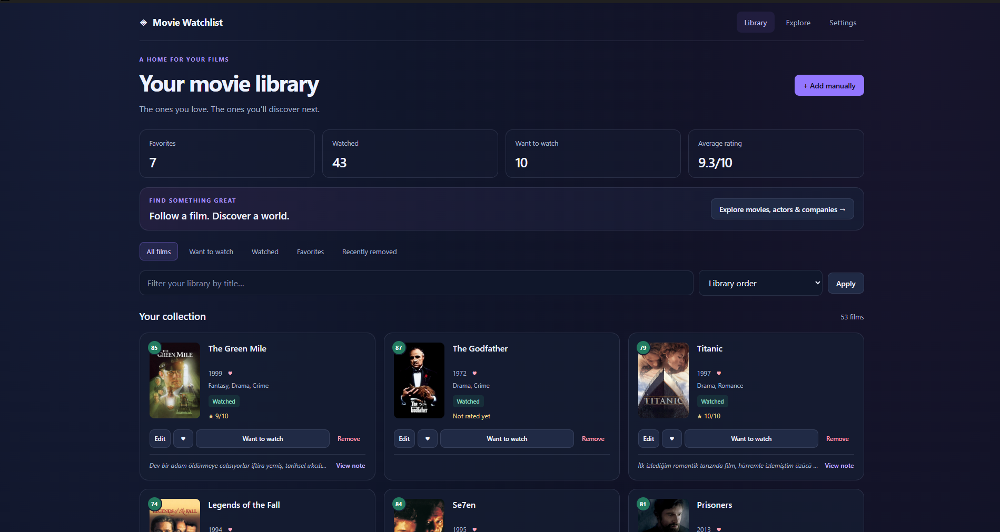
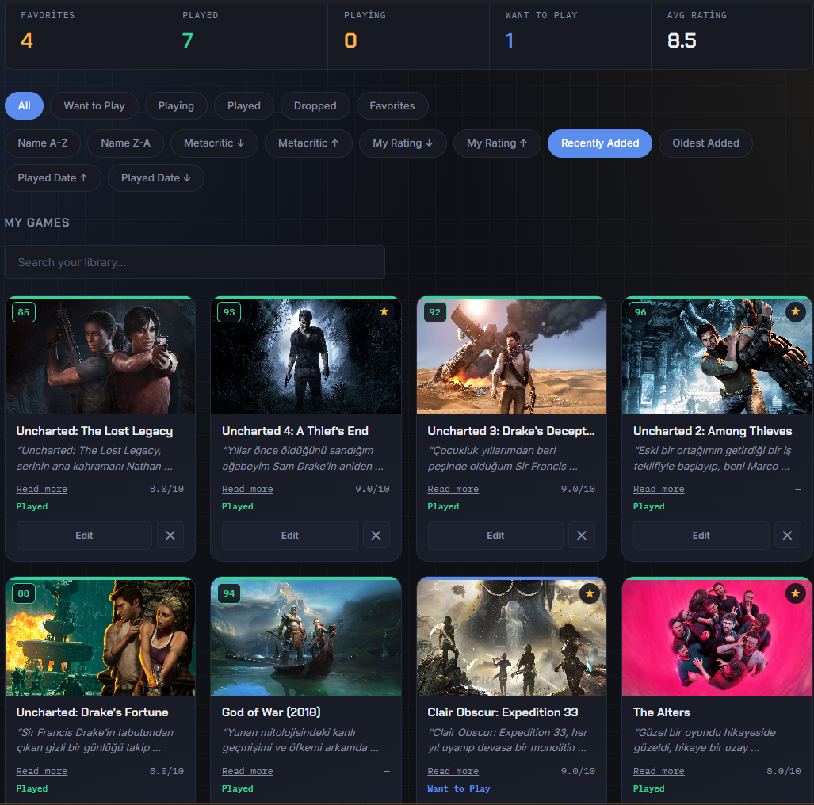
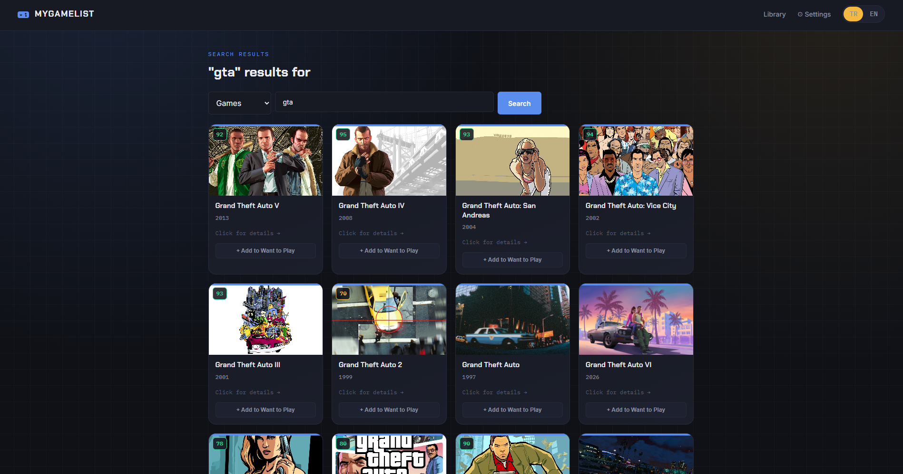
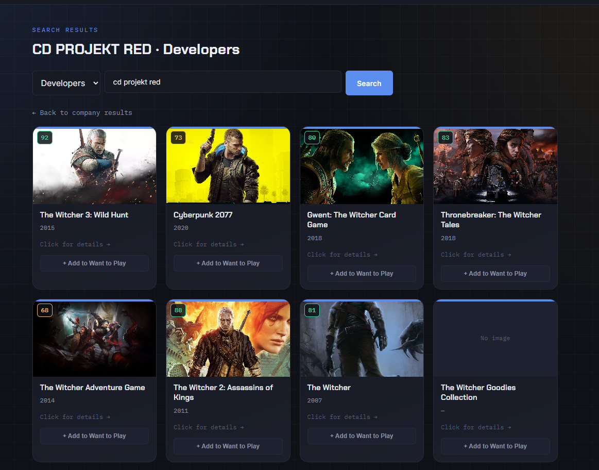

# 🎮 MyGameList

**Your games, your ratings, your notes.**

A personal game library for Windows, with fast discovery, local storage, and a dark interface in English and Turkish. Track what you want to play, what you are playing, and what you have finished—without creating a MyGameList account.

[**Download for Windows**](https://github.com/keremakcn/mygamelist/releases/latest) · [All releases](https://github.com/keremakcn/mygamelist/releases) · [Get a RAWG API key](https://rawg.io/apidocs)

## Get started

1. Download the **MyGameList ZIP** from the latest release's **Assets**. Choose the app archive, not the source-code archive.
2. Extract it and open **`MyGameList.exe`**. No Python installation is needed.
3. Open **Settings** and enter your own RAWG API key to search for games.
4. Find a game and add it to your library. Use **Edit** to change its status, rating, notes, or favorite flag.

The app opens without an API key; online discovery requires one. Your existing library remains available offline, including saved game details and covers that were downloaded successfully.

## Screenshots

### Personal library
Track your games, ratings, favorites, and notes in one place.





### Search and discovery
Find games, developers, and publishers with live search suggestions.





## What you can do

| Discover games | Manage your library |
|---|---|
| Search games, developers, or publishers | Track Want to Play, Playing, Played, and Dropped |
| See suggestions while typing | Filter your library instantly as you type |
| Browse a company's games from its name | Add games directly from search result cards |
| See Metacritic scores and open trailer searches | Give personal ratings from 0–10 and mark favorites |
| Find relevant matches ranked by popularity | Write notes with expandable previews on cards |
| Browse additional result pages | Undo deletion without losing notes or ratings |

The library shows **newest additions first** by default. You can filter by status or favorites and sort by name, Metacritic, personal rating, date added, or played date. Saving an edit returns you to the library.

### Two kinds of search

- **Discovery search** queries RAWG for games or companies. Games are selected by default; choose Developers or Publishers to browse those instead.
- **Library search** filters the games currently shown in your library, alongside your active status/favorites filter. It does not need an internet connection or an Enter key press.

Discovery suggestions appear after **three characters** and a short typing pause, with up to **five results**. Use **↑ / ↓** to select, **Enter** to open a selection, or **Escape** to close the list. Pressing Enter without a selection opens the full results page.

Game search supports partial titles such as `god war` and `modern warfare`. Matching all query words takes priority; popularity then orders games within the same match group. It also recognizes:

- **`gta` → `Grand Theft Auto`**, regardless of capitalization, when entered as a separate word.
- **`1–10` ↔ `I–X`**, so `gta 4` and `GTA IV` use equivalent searches.

Results depend on RAWG's catalog. A missing Metacritic score means no score is available from the supplied game data.

### Notes and undo

Notes appear in gray italic text on your cards. Long notes show a two-line preview; **Read more / Show less** expands or collapses the selected card. Other cards keep their height.

After deleting a game, click **Undo** in the temporary notification to restore its status, rating, note, favorite flag, played date, and original added-order position. If you have already re-added the game, undo will not overwrite the new entry.

## Updates, storage, and backups

**To update:** close MyGameList, extract the new release, and replace the old EXE. Your saved data is separate from the executable, so moving or replacing it preserves your library.

| How you run the app | Data location |
|---|---|
| Packaged Windows EXE | `%APPDATA%\MyGameList` (`AppData\Roaming`) |
| Python source | The project directory |

Both locations use the same file structure:

```text
games.db       Library, notes, ratings, favorites, dates, and cached game details
config.json    API key saved through Settings
game_images/   Downloaded cover images
```

**Do not delete `%APPDATA%\MyGameList` when updating.** Source and EXE runs use separate locations, so a library created in one does not automatically appear in the other.

To back up your data, close the app and copy these files and the image folder to a safe location. To restore, close the app, keep a copy of the current data, and place the backup in the appropriate data directory. Backups can contain your API key; keep them private.

There is currently **no automatic backup, cloud sync, or account system**.

## Run from source

The following commands use **Windows PowerShell** and require **Python 3.10+** and Git. They call the virtual environment directly, so you do not need to activate it.

```powershell
git clone https://github.com/keremakcn/mygamelist.git
cd mygamelist
python -m venv .venv
.\.venv\Scripts\python.exe -m pip install -r requirements.txt
.\.venv\Scripts\python.exe app.py
```

Open **http://127.0.0.1:5000**. The database is initialized automatically. Configure your RAWG key through Settings, or copy `.env.example` to `.env` and set:

```dotenv
RAWG_API_KEY=your_key_here
```

To run the desktop window instead, stop the web version and run:

```powershell
.\.venv\Scripts\python.exe -m pip install pywebview
.\.venv\Scripts\python.exe run_desktop.py
```

The `RAWG_API_KEY` environment variable, including values loaded from `.env`, takes precedence over the key in `config.json`. In packaged runs, `.env` is read from beside the EXE; Settings saves to the AppData directory.

## Build a Windows release

After completing the source setup, close running copies of MyGameList and run:

```powershell
.\.venv\Scripts\python.exe -m pip install pywebview pyinstaller
.\.venv\Scripts\python.exe -m PyInstaller --clean --noconfirm --onefile --windowed --name MyGameList --icon=icon.ico --add-data "templates;templates" --add-data "static;static" run_desktop.py
```

Alternatively, use the repository's packaging configuration:

```powershell
.\.venv\Scripts\python.exe -m PyInstaller --clean --noconfirm MyGameList.spec
```

The result is **`dist/MyGameList.exe`**, with templates and static assets included. Test the generated EXE, then ZIP it for the release. Do not package personal `.env`, `config.json`, `games.db`, or `game_images/` files.

## Project guide

Built with **Python, Flask, SQLite, Jinja2, JavaScript, PyWebView, and PyInstaller**. Game metadata and cover images come from [RAWG](https://rawg.io/apidocs).

| File or directory | Purpose |
|---|---|
| `app.py` | Routes, RAWG queries, search ranking, suggestions, and library actions |
| `database.py` | Database initialization, library queries, and deletion/restore transactions |
| `translations.py` | English and Turkish interface text |
| `run_desktop.py` | Desktop window entry point |
| `templates/` | Page templates and the shared `_discovery_search.html` form |
| `static/style.css` | Theme and card layout |
| `static/library-search.js` | Instant library filtering |
| `static/search-suggestions.js` | Suggestions and keyboard navigation |
| `static/library-actions.js` | Quick add, undo notifications, and note expansion |
| `MyGameList.spec` | Executable packaging settings |
| `.env.example` | Example API-key configuration |

SQLite separates cached game metadata (`games`) from your personal entries (`my_games`). The `deleted_game_entries` table holds snapshots used by undo. Each user supplies their own RAWG API key; none is bundled with the release.

## Troubleshooting

- **Search is unavailable:** check your internet connection and RAWG key in Settings. If running from source, a key in `.env` overrides the one saved through Settings.
- **The library looks empty after switching between source and EXE:** check the two data locations above. Switching launch methods does not migrate your library.
- **Changes do not appear in the EXE:** rebuild it from the updated source. Editing Python, HTML, or CSS files does not update an already packaged executable.
- **`python` is not recognized:** if the Windows Python launcher is installed, use `py` for the initial environment-creation command.

## License and credits

Personal project; no license has been specified.

Game data and artwork are provided by the [RAWG Video Games Database API](https://rawg.io/apidocs).
